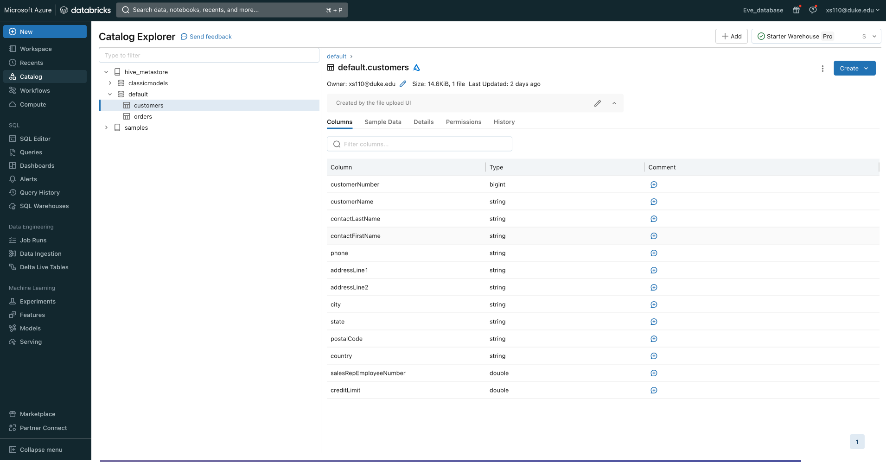
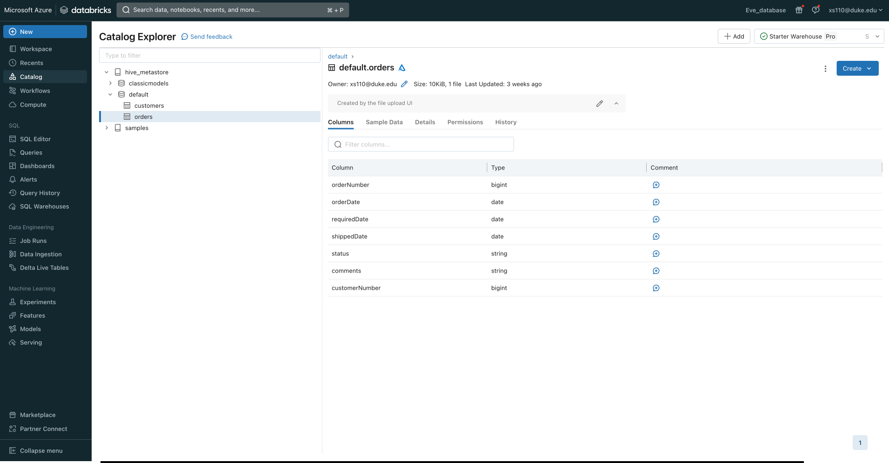
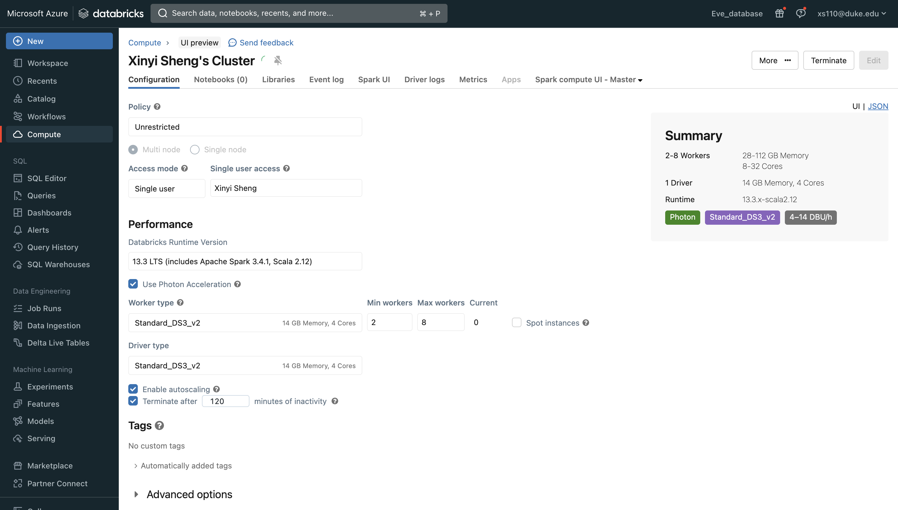
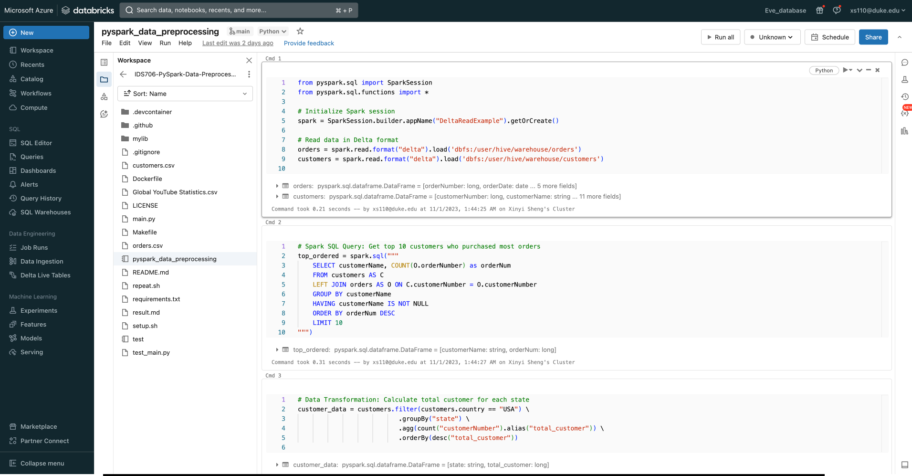
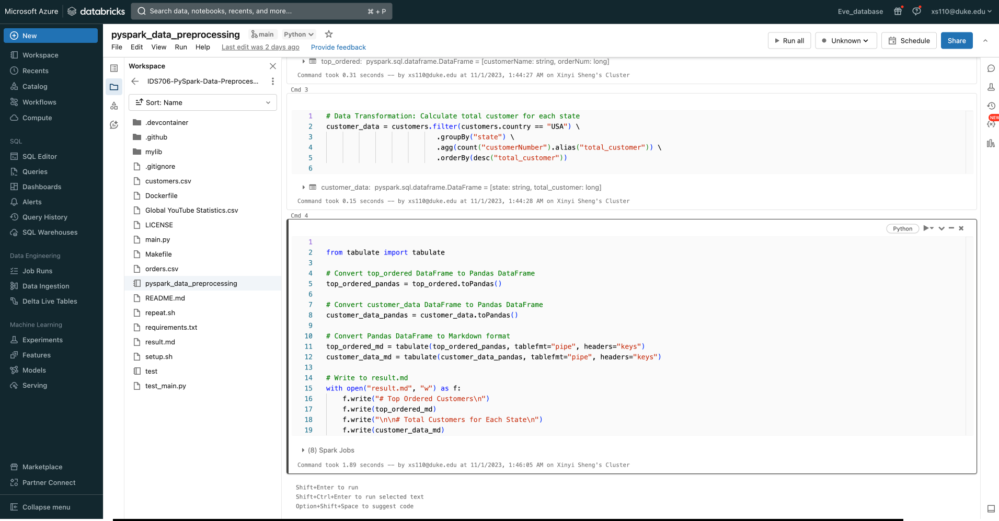
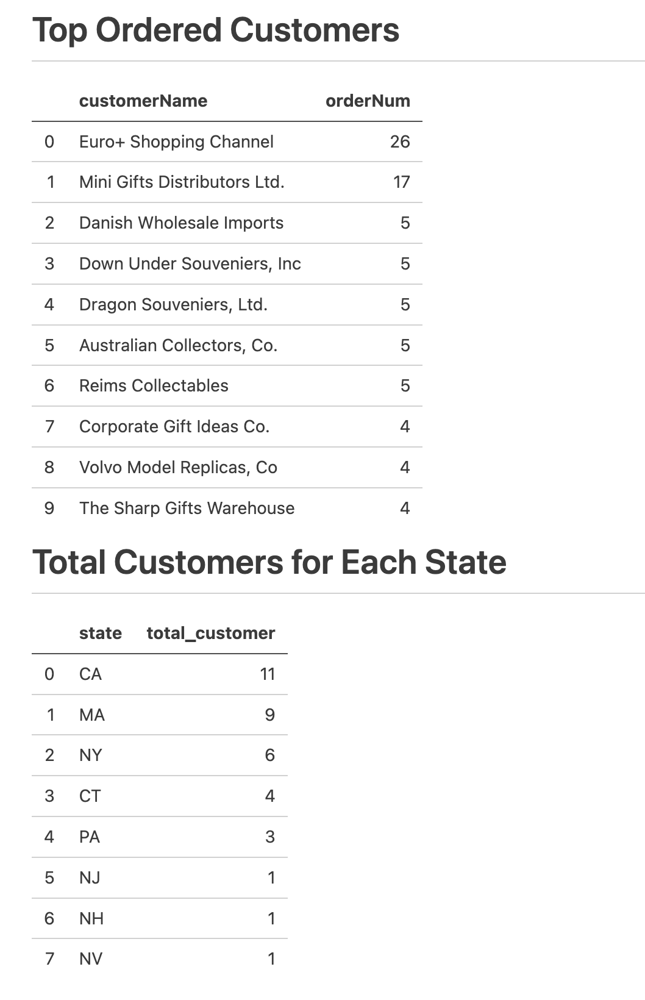

# Use PySpark to perform data processing on a large dataset.

This project did data processing on a large dataset using PySpark. The dataset is stored in databricks data file system(DFS), specifically the orders and customers tables.
## Setup


### 1. Upload tables to databricks

I used `add data` UI in databricks to upload the orders.csv and customers.csv to DFS. They are saved in `dbfs:/user/hive/warehouse`

***customers:***


***orders:***


### 3. Create a Spark cluster



Create one cluster in my Azure Databricks workspace by using the Azure Databricks portal.

### 2. create pyspark_data_preprocessing.py notebook in databricks

I wrote my code in pyspark_data_preprocessing.py:

code1

code2



I did:

1. Loading data into a dataframe

```python
# Read data in Delta format
orders = spark.read.format("delta").load('dbfs:/user/hive/warehouse/orders')
customers = spark.read.format("delta").load('dbfs:/user/hive/warehouse/customers')
```
2. use spark SQL and filtering and grouping dataframe(see part3 in the following)


### 3.Use of Spark SQL and Transformations

***Spark SQL***: A SQL query is employed to fetch the top 10 customers who have placed the most orders. This serves as an example of leveraging Spark's SQL capabilities to extract insights directly from distributed datasets.

```python
# Spark SQL Query: Get top 10 customers who purchased most orders
top_ordered = spark.sql(
    """
    SELECT customerName, COUNT(O.orderNumber) as orderNum
    FROM customers AS C
    LEFT JOIN orders AS O ON C.customerNumber = O.customerNumber
    GROUP BY customerName
    HAVING customerName IS NOT NULL
    ORDER BY orderNum DESC
    LIMIT 10
"""
)
```
***Data Transformation***: PySpark's DataFrame API is utilized to transform the customer data. The data is first filtered to only include records from the USA. Subsequently, it's grouped by state to aggregate the count of customers in each state. This showcases the transformation capability of PySpark in handling and reshaping large datasets.

```python
customers.filter(customers.country == "USA")
  .groupBy("state")
  .agg(count("customerNumber").alias("total_customer"))
  .orderBy(desc("total_customer"))

```

## Results

[](https://github.com/nogibjj/IDS706-PySpark-Data-Preprocessing-XS110/actions/workflows/cicd.yml)

The results are converted to a user-friendly markdown format using the tabulate library and saved to [`result.md`](https://github.com/nogibjj/IDS706-PySpark-Data-Preprocessing-XS110/blob/main/result.md). This markdown file contains tables showing the top 10 customers by order volume and the count of customers for each state in the USA.

